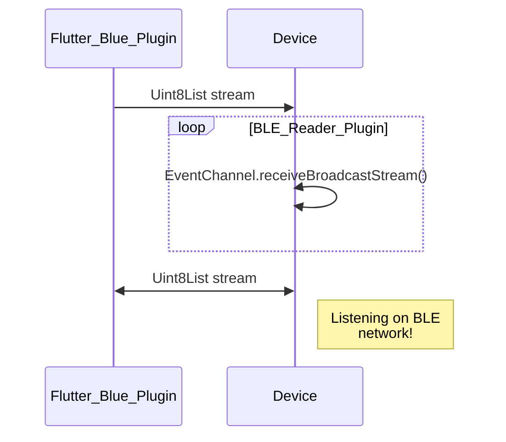

> ⚠⚠ IMPORTANT INFO ⚠⚠ 
>
> Consider also the source code of BLE_READER PLUGIN - that was written and released espessialy for these Quiz solution 🥵 (both IOS and Android supported).
> You can explore documentation and learn more about Peripheral mode and streaming data that is received via Bluetooth Low Energy network solution for flutter at 👉 https://pub.dev/packages/ble_reader

# Yandex Cup 2022 : Mobile Track : Quiz С
<p align="center">
   <a href="">
    
  </a>
  <a href="https://github.com/rrousselGit/riverpod">
    
  </a>
</p>

## Key Concepts 



## Setup 
```
➜  folder ✗ git clone https://github.com/Doldrums/b.git
➜  b git:(master) ✗ flutter pub get
# in case there are conflicts in generated files
➜  b git:(master) ✗ flutter pub run build_runner build --delete-conflicting-outputs
```

